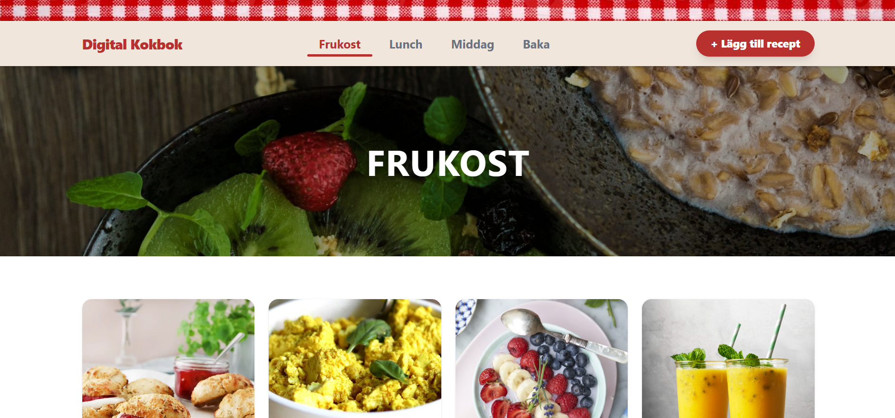

# Digital Cookbook - Fullstack Portfolio Project
> Keep all your recipes in one place. A fullstack portfolio project.

## Live Demo
[digital-cookbook-flame.vercel.app](https://digital-cookbook-flame.vercel.app)

## Deployment

Frontend is deployed on Vercel.  
Backend is deployed on Render.

[](https://react.dev)
[](https://vitejs.dev)
[](https://fastapi.tiangolo.com)
[](https://supabase.com)
[](https://tailwindcss.com)


---

## Getting Started

You will need **Node.js** and **Python** installed on your machine.

### 1. Backend (FastAPI)

```bash
cd Kokbok/backend

# Create and activate virtual environment
python -m venv venv

# Windows
.\venv\Scripts\activate
# Mac/Linux
source venv/bin/activate

# Install dependencies
pip install -r requirements.txt

# Start the server
python main.py
```

The server will run at http://localhost:8000

### 2. Frontend (React + Vite)

Open a new terminal window:

```bash
cd frontend
npm install
npm run dev
```

The app will run at http://localhost:5173

---

## Environment Variables

Create the following .env files before starting the project:

**`/backend/.env`**
```env
SUPABASE_URL=your_supabase_url
SUPABASE_SERVICE_KEY=your_secret_service_role_key
```

**`/frontend/.env.local`**
```env
VITE_SUPABASE_URL=your_supabase_url
VITE_SUPABASE_ANON_KEY=your_public_anon_key
VITE_API_URL=http://localhost:8000
```

---

## Project Structure

### Frontend (`/frontend/src`)
- `assets/` – Images and static files
- `components/` – React components
  - `hooks/` – Custom React hooks (e.g., form logic)
  - `RecipeForm/` – Form components for creating/editing recipes
- `pages/` – Page components (/new-recipe, /:category, /recipe/:category/:id)
- `styles/` – CSS and themes
- `utils/` – Helper functions (validation, form helpers)

### Backend (`/backend`)
- `main.py` – API routes, CORS configuration, and Supabase connection
- `models.py` – Pydantic models for incoming data validation
- `requirements.txt` – Python dependencies

---

## Tech Stack

| Del      | Teknik                              |
|----------|-------------------------------------|
| Frontend | React, Vite, Tailwind CSS, Lucide   |
| Backend  | Python, FastAPI, Uvicorn            |
| Database  | Supabase (PostgreSQL)               |

