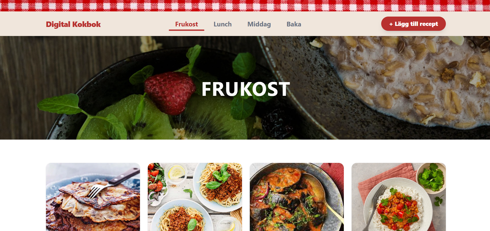

# Digital Kokbok - portfolioprojekt fullstack

> Alla dina recept, alltid nära till hands. Sluta leta efter borttappade länkar och fokusera på matlagningen.
> Byggt som ett portfolioprojekt med planer på inloggning, filtrering och sökning i framtiden.

[](https://react.dev)
[](https://vitejs.dev)
[](https://fastapi.tiangolo.com)
[](https://supabase.com)
[](https://tailwindcss.com)


---

## Kom igång

Du behöver **Node.js** och **Python** installerat på din dator.

### 1. Backend (FastAPI)

```bash
cd Kokbok/backend

# Skapa och aktivera virtuell miljö
python -m venv venv

# Windows
.\venv\Scripts\activate
# Mac/Linux
source venv/bin/activate

# Installera beroenden
pip install -r requirements.txt

# Starta servern
python main.py
```

Servern körs på **http://localhost:8000**

### 2. Frontend (React + Vite)

Öppna ett nytt terminalfönster:

```bash
cd frontend
npm install
npm run dev
```

Appen körs på **http://localhost:5173**

---

## Miljövariabler

Skapa följande `.env`-filer innan du startar projektet:

**`/backend/.env`**
```env
SUPABASE_URL=din_supabase_url
SUPABASE_SERVICE_KEY=din_hemliga_service_role_key
```

**`/frontend/.env.local`**
```env
VITE_SUPABASE_URL=din_supabase_url
VITE_SUPABASE_ANON_KEY=din_publika_anon_key
VITE_API_URL=http://localhost:8000
```

---

## Projektstruktur

### Frontend (`/frontend/src`)
- `assets/` – Bilder och statiska filer
- `components/` – React-komponenter
  - `hooks/` – React-hooks (t.ex. formulärlogik)
  - `RecipeForm/` – Formulärkomponenter för att skapa/redigera recept
- `pages/` – Sidkomponenter (`/nytt-recept`, `/:category`, `/recept/:category/:id`)
- `styles/` – CSS och teman
- `utils/` – Hjälpfunktioner (validering, formulärhjälp)

### Backend (`/backend`)
- `main.py` – API-routes, CORS-konfiguration och Supabase-uppkoppling
- `models.py` – Pydantic-modeller för validering av inkommande data
- `requirements.txt` – Python-beroenden

---

## Teknikstack

| Del      | Teknik                              |
|----------|-------------------------------------|
| Frontend | React, Vite, Tailwind CSS, Lucide   |
| Backend  | Python, FastAPI, Uvicorn            |
| Databas  | Supabase (PostgreSQL)               |